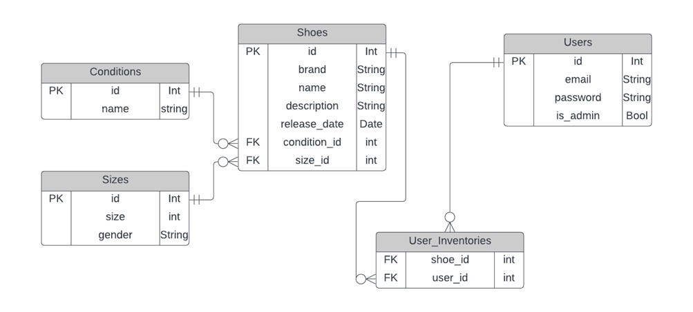
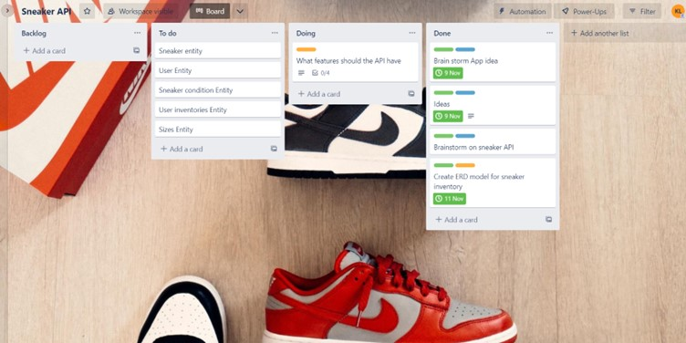

#T2A2 API Webserver Project
### Sneaker Inventory
----------------------------------------------------------------
#### Link to Github repo:
[Github Repo](https://github.com/BigAlzzz/T2A2-API-Webserver-Project)

---
#### R1
There is a vast sneaker community in Australia. Through web research some gaps were identified in the sneaker space, there doesn’t seem to be an application/platform where users are able to keep stock of their sneaker collection, users are also unable to share their collection collectively and a space where users are able to comment on other user’s sneaker/collection. The goal is to incorporate these into an application.

---
#### R2
The problems identified that this API will look to solve is to provide a secured application to the sneaker community where, users are able to log into a personal account, store their sneakers into their account and be able to view other users to admire/rate and comment on other users’ sneakers.

---
#### R3
The chosen database system is PostgreSQL, one of the reasons why this database system was chosen was because this was the database system used in our course. Other reasons are that it is JSON typed, PostgreSQL supported all data types, it provided data integrity where constraints and regulation of data was easily implemented.

PostgreSQL has some drawbacks when it is compared to other database systems, such drawbacks are slower reading speeds with the use of high memory, the initial configuration can be tricky and that it may not be supported in open-source apps.

---
#### R4
Object relational mapping.
ORM has SQL objects mapped, these are relational which have the primary keys and foreign keys in objects and code. Users are able to read, view and respond to the objects and these can be manipulated.
The CRUD operation structure is created by the ORM, this improves it readability and documentation allowing for more efficient development.
ORMs also have integrated SQL injection protection.

---
#### R5
| Endpoints | Description | HTTP Request | 
|---------  |-------------|--------------| 
| /auth/users | Returns all the user | GET | 
| /auth/register | Registers a new user | POST | 
| /auth/login | Logins the registered user | POST | 
| /shoes | Returns all shoes | GET | 
| /shoes/<int:id> | Return id shoe | GET | 
| /shoes/<int:id> | Delete requested id shoe | DELETE | 
| /shoes/<int:id> | Edits requested id shoe data | PUT, PATCH | 
| /shoes | Create a shoe | POST |

---
#### R6

---
#### R7
Flask_Marshmallow
-	A thin integration layer for Flask the python web framework and marshmallow, an object serialization/deserialization library.
-	Marshmallow is an object-relational mapping library that converts objects to and from python data types. It is usually used with SQLAlchemy, an ORM that maps database schemas to Python objects. 
-	It is used to de-serialise python dicts to SQLAlchemy models and vice versa.
Flask_SQLalchemy
-	This is the library that facilitates the communication between Python programs and databases. It is usually used as an ORM tool, this translates Python classes to tables on relational databases and converts function calls to SQL statements.

Flask_bcrypt
-	This provides bcrypt hashing utilities to our application. It is a hashing facility that is designed to “de-optimise”. It intentionally slows the structure and is usually used for sensitive data that needs to be protected

Flask_jwt_extended
-	Adds support for using JSON web tokens to Flask for protecting rotues
-	Providing a means of transmitting information from the client to the server in a stateless secure way.

---
#### R8
There are 5 main entities that make up the application. 
Users: 
•	The Users model consists of an id, email, password and is_admin. The id is the models primary key and is uniquely given to all users. The email provided is also a unique key to reduce duplicates of user. The user model provides different roles to certain users, which allows admins to create and remove certain data.
Shoes
-	The Shoes model is the main entity of the application. The entity consist of the id, brand, name, description, release_date, condition_id and size_id. These attributes are called upon to display information of the shoe to the user. The shoe model will have a controller where CRUD specifies their functions. Information can be created, deleted, edited through PUT and PATCHES.
User_inventories
-	The user inventory model is where we are able to pull entity information from the user and the shoe. It is in this model that Users are able to join a shoe to their inventory. This model is the main feature of the app as this is a shoe inventory app.
-	The model consist of shoe_id and user_id and these are foreign keys to the Users and Shoes model.
Conditions
-	This was to help display the condition of the shoes through a foreign key to tie back into the shoe model. The condition model consists of id and name(condition).
Sizes
-	The Size model is similar to the conditions model and is used as a foreign key to the main shoe model to indicates a shoes size and the gender for the shoe.

---
#### R9

Seen in the ERD, there are 4 main entities and 1 join table. The entities are Users, Shoes, Conditions and Sizes and the join table is User_inventories.
-	Shoes have a one to many relationship with User_inventories, a none to one relationship with Conditions and a none to one relationship with Sizes
-	Users have a one to many relationship with User_inventories
-	Conditions have a one to many relationship with Shoes with condition_id
-	Sizes have a one to many relationship with Shoes with Size_id
-	In the join table User_inventories a many to many relationship is seen between shoe_id and user_id.

---
#### R10

A Trello board was used to track the task needed throughout the project.
The aspects of the project were broken down to task that needed to be done and tracked across doing and done.
The link to my trello board is here
[Trello Board](https://trello.com/invite/b/eIJS2WDk/ATTI9bb5b6fe7ddd798fcd8749c6ff92cd8bF2463264/sneaker-api)